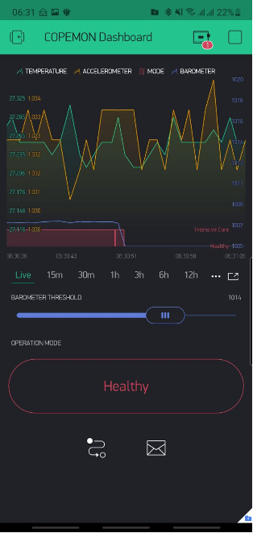

# arm_iot_device
code implementation for an ARM Cortex M4 microcontroller (STM32) to simulate an IoT medical device.

The sensors used are:
Accelerometer - To simulate the posture of the patient, specifically for fall detection.
Magnetometer - To simulate the orientation of the patient lying on the bed. Proper orientation is important in ensuring that other monitoring / life-saving equipment remains connected properly.
Pressure Sensor - To simulate the pressure of air in the patient's lungs.
Temperature Sensor - To simulate body temperature.
Humidity Sensor - To simulate the relative humidity of the air passed into the patient's lungs.
Gyroscope - To simulate patient's movement; specifically to sense the patient's sudden twisting/twitching which could be an indication that the patient is in pain. A sudden movement can also cause issues with the other monitoring / life-saving equipment such as ventilators

The data collected from the sensors are sent to a Blynk.io server, and then displayed on a phone application:

Mobile Dashboard:

